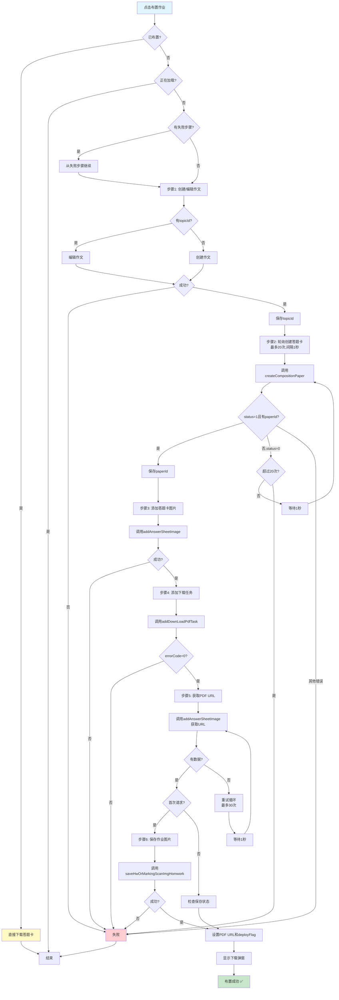

# 作文作业布置流程 - 飞书文档版

## 📊 主流程图（Mermaid格式 - 可直接复制到飞书）



---

## 📋 流程步骤表格（可直接复制到飞书表格）

| 步骤 | 步骤名称       | 函数名                       | API调用                                          | 成功条件                      | 失败处理               | 备注                                             |
| ---- | -------------- | ---------------------------- | ------------------------------------------------ | ----------------------------- | ---------------------- | ------------------------------------------------ |
| 1    | 创建/编辑作文  | `executeCreateComposition()` | `createComposition()`<br/>或 `editComposition()` | `res.code === '1'`            | 标记失败步骤，显示错误 | 有topicId则编辑，无则创建                        |
| 2    | 轮询创建答题卡 | `pollCreatePaper()`          | `createCompositionPaper()`                       | `status === 1` 且有 `paperId` | 超过20次显示"解析失败" | 轮询间隔1秒，最多20次                            |
| 3    | 添加答题卡图片 | `executeAddAnswerSheet()`    | `addAnswerSheetImage()`                          | `res.code === '1'`            | 标记失败步骤，显示错误 | 参数：paperSize, topicId, hwId, layout, rowCount |
| 4    | 添加下载任务   | `executeAddDownloadTask()`   | `addDownLoadPdfTask()`                           | `errorCode === 0`             | 标记失败步骤，显示错误 | 包含作业信息、纸张大小等参数                     |
| 5    | 获取PDF URL    | `getPdfUrl()`                | `addAnswerSheetImage()`                          | 获取到 `imgUrl` 且保存成功    | 标记失败步骤，显示错误 | 重试最多30次，间隔1秒                            |
| 6    | 保存作业图片   | `saveHomeworkImage()`        | `saveHwOrMarkingScanImgHomwork()`                | `res.code === '1'`            | 标记失败步骤，显示错误 | 成功后显示下载弹窗                               |

---

## 🔄 文本流程图（纯文本格式）

```
┌─────────────────────────────────────────────────────────────┐
│                    点击"布置作业"按钮                          │
└───────────────────────┬───────────────────────────────────────┘
                        │
                        ▼
                ┌───────────────┐
                │ 已布置成功？   │
                │ deployFlag?   │
                └───┬───────┬───┘
                    │是     │否
                    ▼       ▼
            ┌───────────┐  ┌──────────────┐
            │ 直接下载   │  │ 检查是否加载中 │
            │ 答题卡     │  └───┬──────────┘
            └───────────┘      │
                               ▼
                        ┌──────────────┐
                        │ 有失败步骤？  │
                        └───┬───────┬──┘
                            │是     │否
                            ▼       ▼
                    ┌───────────┐  ┌────────────────────┐
                    │ 从失败步骤 │  │ 步骤1: 创建/编辑作文 │
                    │ 继续执行   │  └───────┬────────────┘
                    └─────┬─────┘          │
                          │                ▼
                          └───────────► ┌──────────────┐
                                        │ 有topicId?   │
                                        └───┬───────┬──┘
                                            │是     │否
                                            ▼       ▼
                                    ┌──────────┐ ┌──────────┐
                                    │ 编辑作文  │ │ 创建作文  │
                                    └─────┬────┘ └─────┬────┘
                                          └─────┬─────┘
                                                ▼
                                        ┌──────────────┐
                                        │ 创建成功？    │
                                        └───┬───────┬──┘
                                            │是     │否
                                            ▼       ▼
                                    ┌──────────┐ ┌──────────┐
                                    │ 保存topicId│ │ 标记失败  │
                                    └─────┬─────┘ └──────────┘
                                          │
                                          ▼
                        ┌─────────────────────────────────────┐
                        │ 步骤2: 轮询创建答题卡                │
                        │ 最多20次，间隔1秒                    │
                        └───────────────┬─────────────────────┘
                                        │
                                        ▼
                                ┌──────────────┐
                                │ 调用API       │
                                │ createCompositionPaper│
                                └───┬──────────┘
                                    │
                                    ▼
                            ┌──────────────┐
                            │ status=1?    │
                            │ 且有paperId? │
                            └───┬───────┬──┘
                                │是     │否
                                ▼       ▼
                        ┌──────────┐ ┌──────────────┐
                        │ 保存paperId│ │ status=0?    │
                        └─────┬─────┘ └───┬──────────┘
                              │           │
                              │           ▼
                              │   ┌──────────────┐
                              │   │ 超过20次?    │
                              │   └───┬───────┬──┘
                              │       │否     │是
                              │       ▼       ▼
                              │   ┌──────┐ ┌──────┐
                              │   │等待1秒│ │ 失败  │
                              │   └───┬──┘ └──────┘
                              │       │
                              │       └───► 继续轮询
                              │
                              ▼
                ┌─────────────────────────────────────┐
                │ 步骤3: 添加答题卡图片                │
                │ 调用 addAnswerSheetImage            │
                └───────────────┬─────────────────────┘
                                │
                                ▼
                        ┌──────────────┐
                        │ 添加成功？    │
                        └───┬───────┬──┘
                            │是     │否
                            ▼       ▼
                ┌──────────────┐ ┌──────────┐
                │ 步骤4: 添加  │ │ 标记失败  │
                │ 下载任务      │ └──────────┘
                └───────┬──────┘
                        │
                        ▼
                ┌──────────────────────┐
                │ 调用 addDownLoadPdfTask│
                └───────┬──────────────┘
                        │
                        ▼
                ┌──────────────┐
                │ errorCode=0? │
                └───┬───────┬──┘
                    │是     │否
                    ▼       ▼
        ┌──────────────┐ ┌──────────┐
        │ 步骤5: 获取  │ │ 标记失败  │
        │ PDF URL      │ └──────────┘
        └───────┬──────┘
                │
                ▼
        ┌──────────────────────┐
        │ 调用 addAnswerSheetImage│
        │ 获取图片URL           │
        └───────┬──────────────┘
                │
                ▼
        ┌──────────────┐
        │ 有数据？      │
        └───┬───────┬──┘
            │是     │否
            ▼       ▼
    ┌──────────┐ ┌──────────────┐
    │ 首次请求? │ │ 重试循环      │
    │ 且无URL? │ │ 最多30次     │
    └───┬──────┘ └───┬──────────┘
        │是          │
        ▼            │
┌──────────────┐    │
│ 步骤6: 保存  │    │
│ 作业图片     │    │
└───────┬──────┘    │
        │           │
        ▼           │
┌──────────────────┐│
│ 调用 saveHwOrMarkingScanImgHomwork│
└───────┬──────────┘│
        │           │
        ▼           │
┌──────────────┐   │
│ 保存成功？    │   │
└───┬───────┬──┘   │
    │是     │否    │
    ▼       ▼      │
┌──────────┐ ┌────┐│
│ 设置URL   │ │失败││
│ 和flag    │ └────┘│
└─────┬─────┘       │
      │             │
      └──────┬──────┘
             │
             ▼
     ┌──────────────┐
     │ 显示下载弹窗  │
     └───────┬──────┘
             │
             ▼
     ┌──────────────┐
     │  布置成功 ✅  │
     └──────────────┘
```

---

## 🔧 失败重试机制

### 失败步骤处理表

| 失败步骤            | 重试条件           | 重试操作               |
| ------------------- | ------------------ | ---------------------- |
| CREATE_COMPOSITION  | -                  | 重新执行创建作文       |
| POLL_CREATE_PAPER   | 有topicId          | 重新执行轮询创建答题卡 |
| POLL_CREATE_PAPER   | 无topicId          | 从创建作文开始         |
| ADD_ANSWER_SHEET    | 有topicId和paperId | 重新执行添加答题卡图片 |
| ADD_ANSWER_SHEET    | 无完整ID           | 从创建作文开始         |
| ADD_DOWNLOAD_TASK   | 有topicId和paperId | 重新执行添加下载任务   |
| ADD_DOWNLOAD_TASK   | 无完整ID           | 从创建作文开始         |
| GET_PDF_URL         | 有topicId和paperId | 重新执行获取PDF URL    |
| GET_PDF_URL         | 无完整ID           | 从创建作文开始         |
| SAVE_HOMEWORK_IMAGE | 有paperId          | 重新执行保存作业图片   |
| SAVE_HOMEWORK_IMAGE | 无paperId          | 从创建作文开始         |

---

## 📝 关键状态变量说明

| 变量名                          | 类型               | 说明                                   |
| ------------------------------- | ------------------ | -------------------------------------- |
| `deployFlag`                    | boolean            | 是否已成功布置作业，为true时可直接下载 |
| `currentPdfUrl`                 | string             | 答题卡PDF的URL地址                     |
| `showDownloadLoading`           | boolean            | 是否显示加载状态                       |
| `deployLoadingText`             | string             | 加载提示文本（如"作业布置中"）         |
| `deployProgress.currentStep`    | DeployStep \| null | 当前执行步骤                           |
| `deployProgress.completedSteps` | Set<DeployStep>    | 已完成的步骤集合                       |
| `deployProgress.failedStep`     | DeployStep \| null | 失败的步骤                             |
| `deployProgress.topicId`        | string \| null     | 题目ID                                 |
| `deployProgress.paperId`        | string \| null     | 答题卡ID                               |

---

## 🎯 特殊场景说明

### 场景1: 从历史记录进入

- **触发条件**: `fromHistory === true` 且有 `cardPdfUrl`
- **处理流程**:
  1. 在 `onMounted` 中验证保存状态
  2. 调用 `saveHwOrMarkingScanImgHomwork` 验证
  3. 验证成功后设置 `deployFlag = true`
  4. 可直接下载，无需重新布置

### 场景2: 修改设置项重置失败状态

- **触发条件**: 修改纸张大小、原图批改留痕、作答横线数
- **处理逻辑**:
  - 如果未布置且失败后，会重置失败状态
  - 保留 `topicId`，清除 `paperId`
  - 确保走编辑流程而不是新增流程

---

## 💡 使用说明

1. **Mermaid流程图**: 可以直接复制代码块到飞书文档，飞书会自动渲染
2. **表格**: 可以直接复制表格内容到飞书表格
3. **文本流程图**: 如果Mermaid不支持，可以使用文本流程图
4. **建议**: 在飞书文档中，优先使用Mermaid格式，如果不支持再使用表格和文本格式
